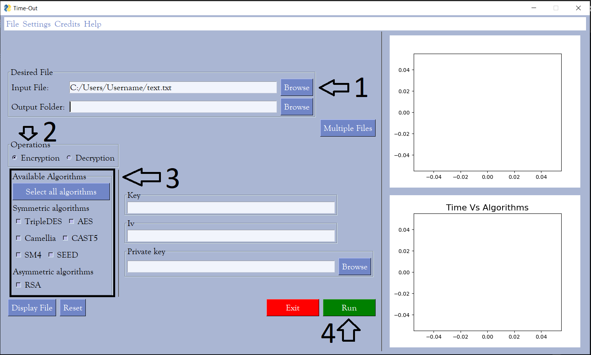
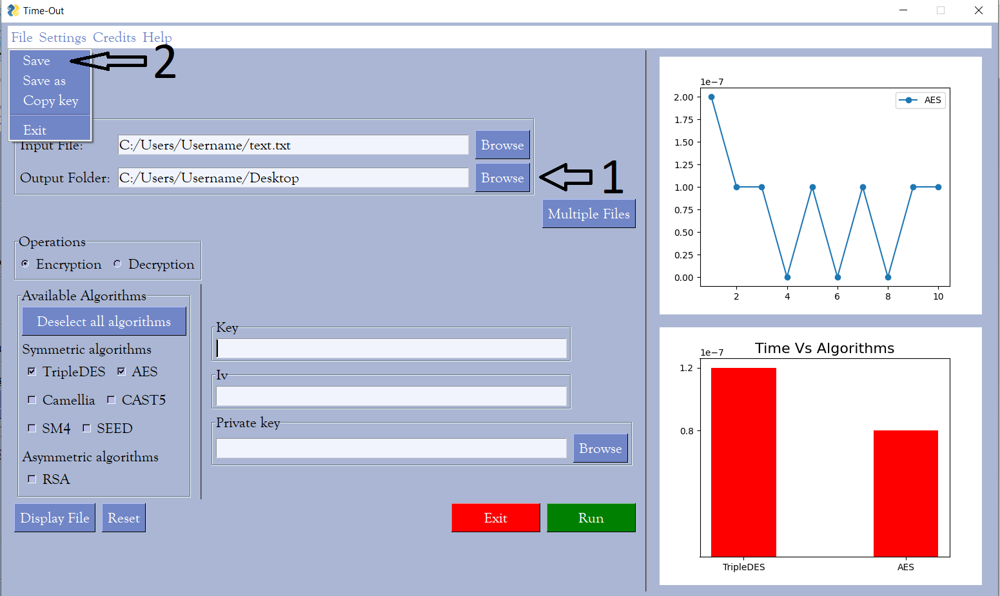
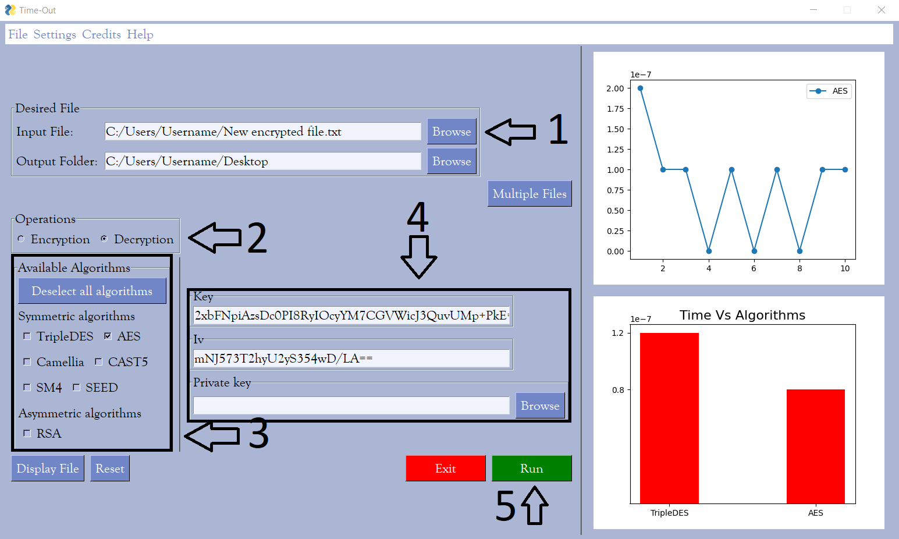

<!--
*** Thanks for checking out the Best-README-Template. If you have a suggestion
*** that would make this better, please fork the repo and create a pull request
*** or simply open an issue with the tag "enhancement".
*** Don't forget to give the project a star!
*** Thanks again! Now go create something AMAZING! :D
-->
<!-- PROJECT LOGO -->
 

<h3 align="center">Encryption-Decryption-Application</h3>

  

    The objective of this app is to take one or multiple text/word files and allows you to choose from a variety of symmetric/asymmetric algorithms to compare their execution time. It can then save the encoded file and also decode it.
     

<!-- TABLE OF CONTENTS -->

  
Table of Contents

  <ol>
    <li>
      <a href="#about-the-project">About The Project</a>
      <ul>
        <li><a href="#built-with">Built With</a></li>
      </ul>
    </li>
    <li>
      <a href="#getting-started">Getting Started</a>
      <ul>
        <li><a href="#prerequisites">Prerequisites</a></li>
      </ul>
    </li>
    <li><a href="#usage">Usage</a></li>
    <li><a href="#roadmap">Roadmap</a></li>
    <li><a href="#contributeurs">Contributeurs</a></li>
    <li><a href="#acknowledgments">Acknowledgments</a></li>
    <li><a href="#bugs-to-fix">Bugs to fix</a></li>
  </ol>

<!-- ABOUT THE PROJECT -->
## About The Project
This is the User Interface of the application as shown.

(<a href="#top">back to top</a>)

### Built With

* [Python](https://www.python.org/)
* [Pysimplegui](https://www.pysimplegui.org/en/latest/)

(<a href="#top">back to top</a>)

<!-- GETTING STARTED -->
## Getting Started

This is an example of an exe file for download.
<a href="./exe/app.exe" download>Download</a>

<!-- USAGE EXAMPLES -->
## Usage
The purpose of this app is to calculate execution time of algorithms.
 
To cover all the necessary fundamental we divided the app in 4 major modes:
<ul>
  <li>How To encrypt:</li>
  
  <ol type="1">
    <li>First of all, choose a file to encrypt</li>
    <li>Then choose encryption as operation</li>
    <li>After that choose (one or more) algorithm(s) for encryption</li>
    <li>Finally press RUN</li>
  </ol>
 
  <li>How To save the encrypted file:</li>
  
  <ol type="1">
    <li>After encryption choose an output folder </li>
    <li>Then press save in the file menu</li>
  </ol>

  
  <li>How To decrypt:</li>
  
    <ol type="1">
      <li>Choose the encrypted file to decrypt</li>
      <li>Choose Decryption as operation</li>
      <li>Choose the adequate algorithm to decrypt (which is mentioned in the save file)</li>
      <li>Then enter the Key and IV (Private Key for assymmetric algorithms) found in the save file</li>
      <li>Finally press RUN</li>
    </ol>
</ul>

(<a href="#top">back to top</a>)

<!-- ROADMAP -->
## Roadmap

- [✓] Encryption/Decryption
- [✓] Themes
- [✓] Multi-File Mode
- [✓] Save/Load
- [✓] Graphic Plots

(<a href="#top">back to top</a>)

<!-- Contributeurs -->
## Contributeurs

* [MOETEZ BOUHLEL](https://github.com/BMoetez)
* [MOHAMED AZIZ BOUACHOUR](https://github.com/Bouachour-Med-Aziz)
* [FIRAS NECIB](https://github.com/firasnecib)

(<a href="#top">back to top</a>)

<!-- ACKNOWLEDGMENTS -->
## Acknowledgments

* Mohamed Houcine Hdhili

(<a href="#top">back to top</a>)

<!-- Bugs to fix -->
## Bugs to fix

1. Unexpected scenarios management
2. Files containing symbols are unsupported

(<a href="#top">back to top</a>)

